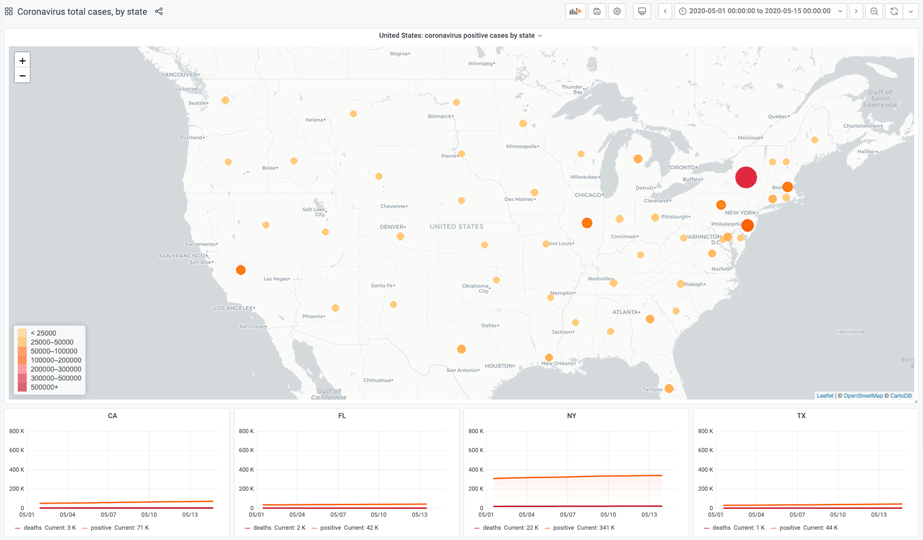

# Demo project to display RedisTimeSeries data on the map in Grafana

<div id="badges" align="center">

[](https://www.grafana.com)
[](https://oss.redislabs.com/redistimeseries/)
[](https://github.com/RedisTimeSeries/grafana-redis-datasource)

</div>


## Introduction

The main purpose of this demo: to show an example of the integration of [RedisTimeSeries](https://oss.redislabs.com/redistimeseries/) and Grafana Worldmap Panel using [Grafana-Redis-Datasource](https://github.com/RedisTimeSeries/grafana-redis-datasource).  Redis Datasource plugin is not officially supported by Grafana Worldmap, but there's a little workaround how to do it. 

For demo purpose we use United States coronavirus statistics from [CoronavirusAPI](http://coronavirusapi.com/) website.
 
Besides standard graph representation, data are also drawn on the map. Besides the standard steps: definition of Datasource and specify the query, we need to do the two more steps: 

1. Apply the Transformation “Labels to fields” to TimeSeries output result
2. Change the map parameter “Location Data” to table mode and map the relevant fields accornidngly, including the `geohash` field 




## The Docker container runs the following applications:

* coronavirusapi_exporter.py - app to get timeseries from weather metrics from http://coronavirusapi.com/
* Redis database with RedisTimeSeries module - to store the timeseries. We also use Redis Set to keep the list of states to use them in Grafana dashborad variable
* Grafana with Redis Data Source - to display the data


### Run using `docker-compose`

The project provides `docker-compose.yml` to start Redis with RedisTimeSeries module, Grafana 7.0 and data exporter.

```bash
docker-compose up
```

## Feedback

We love to hear from users, developers and the whole community interested by this plugin. These are various ways to get in touch with us:

- Ask a question, request a new feature and file a bug with GitHub issues.
- Star the repository to show your support.

## Contributing

- Fork the repository.
- Find an issue to work on and submit a pull request
- Could not find an issue? Look for documentation, bugs, typos, and missing features.

## Other interesting resources

- [RedisTimeSeries](https://oss.redislabs.com/redistimeseries/)
- [Grafana Redis Data Source](https://grafana.com/grafana/plugins/redis-datasource)
- [Grafana Smart Weather Dashboard](https://github.com/RedisTimeSeries/redis-weather)

## License

- Apache License Version 2.0, see [LICENSE](LICENSE)
